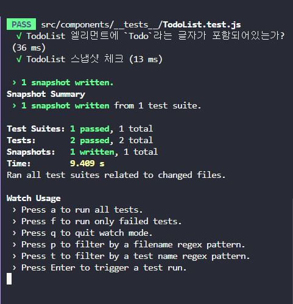
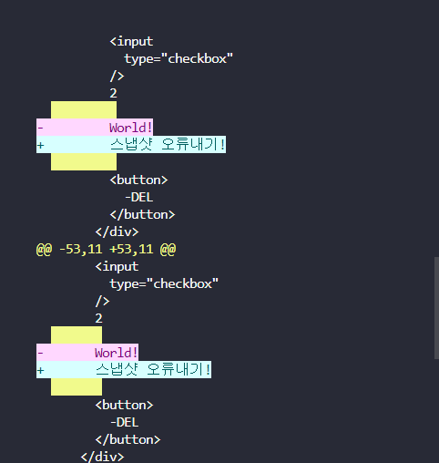

# redux toolkit project

## Available Scripts

project 실행.

### `npm start`

project test.

### `npm test`

## 작업 순서
- [x] pure react todoList  
- [x] useReducer 활용  
- [x] react-redux 활용  
- [x] redux-toolkit의 slice활용  
- [x] component 분리   
- [x] json webserver  (run : json-server --watch db.json)
- [x] redux-thunk  
- [x] json webserver  
- [x] Test - react-testing-library (npm install --save-dev @testing-library/react)
- [] react-query로 비동기 통신 대체  

### test

추가 스터디
1. 비동기처리 테스트 (done, async await)
2. mockFn

### 스냅샷 테스트
- 첫 스냅샷 테스트 후 테스트 데이터가 변경되면 스냅샷은 변경되지 않기 때문에 테스트가 실패한다.
  - 이럴 경우 2가지 대응 방법이 있다.
  1) 스냅샷을 변경된 버전으로 다시 수정해서 찍는다 (test 터미널 `u`버튼 클릭) -> 이게 버그여서 실패한건지, 아니면 수정된건지 정확히 판단해서 `u`를 누르는게 중요하다.
  2) mockFn을 활용한다.